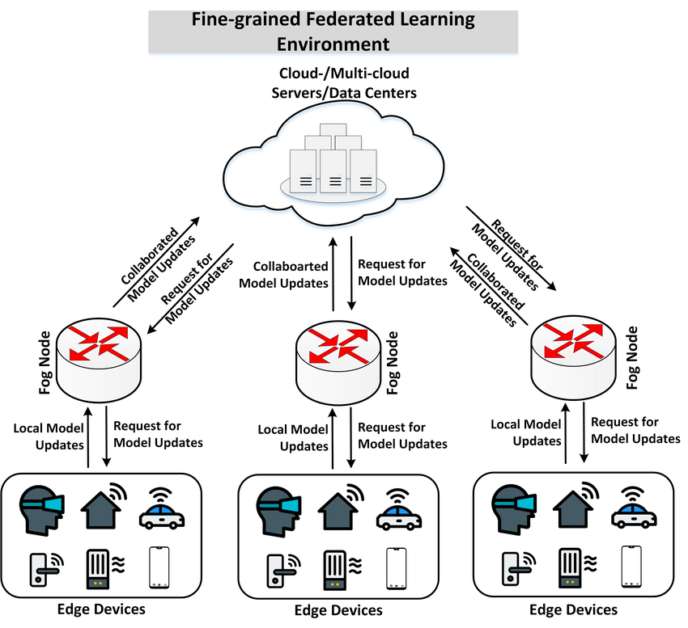

# See through Gradients: Image Batch Recovery via GradInversion

之所以介绍这个工作，是因为这个攻击通过梯度对于其他人的训练数据进行还原，效果也十分不错。

先前的攻击大多是成员推断攻击（membership inference）, 大家使用差分隐私（DP，Differential Privacy）来进行数据的保护。成员推断攻击的目的是推断一个数据是否被用于模型的训练，但是一般来说大家会假设攻击者手上有一堆数据，既包括训练数据的一部分，也包括一些额外的数据。这个假设还是比较强的，在实际上，攻击者可能根本拿不到训练数据的一部分。

仍然缺少一个比较强的攻击，而这次的工作通过梯度对训练数据进行逆向，结果还十分不错，相当值得分享给大家！

关于联邦学习
首先需要先介绍一下联邦学习，如下图所示：

会有许多参与者一同参与训练过程，每一个参与者拥有自己的数据，并且在本地进行训练，本地训练完之后会上传模型参数，由一个中心节点对进行模型的聚合，然后再下发到每一个参与者本地进行模型的同步。

联邦学习的优势在于，每一个节点的数据都保持在本地，保证了数据隐私，实现了异构数据的访问（也就是每一个参与者自己解决数据的访问问题，即便数据是异构的不会影响整体）。

但是，参与者仍然要将模型上传，这会不会造成数据隐私泄漏呢？

### 基于梯度的数据还原

首先，我们先给出目标的形式化：
$$
x^* = \arg \min_{\hat{x}} \mathcal{L}_{grad}(\hat{x};W, \Delta W) + \mathcal{R}_{aux}(\hat{x})
$$
其中

其中 $\hat{x} \in \mathbb{R}^{K\times C\times H\times W} $($K$ 是batch size, $C , H , W$ 分别是通道数、高度、宽度)， 式子中的 $W$是模型的权重，$\Delta W$ 是聚合后的模型权重的变化量。

其中 $\mathcal{L}_{grad}$的目的是，找到一些可能的输入，使得用这些输入训练后得到的权重，与聚合后的权重尽可能一致。

具体形式为
$$
\mathcal{L}_{grad}(\hat{x};W,\Delta W)=\alpha_G\Sigma_{l}||\nabla_{W^{(l)}}\mathcal{L}(\hat{x},\hat{y}) - \Delta W^{(l)}||_2
$$
其中$\Delta W^{(l)} = \nabla_{W^{(l)}}\mathcal{L}(x^*,y^*)$, 代表真实的训练数据导致的第$l$层权重的变化量

先前的优化式子还有一项，称之为辅助的正则项（auxiliary regularization），具体形式为
$$
\mathcal{R}_{aux}(x) = \mathcal{R}_{fidelity}(x) + \mathcal{R}_{group}(x)
$$
由两项组成，第一项驱使$x$与真实的训练样本相似 ，第二项是一致性，我们会在后续给出说明。
