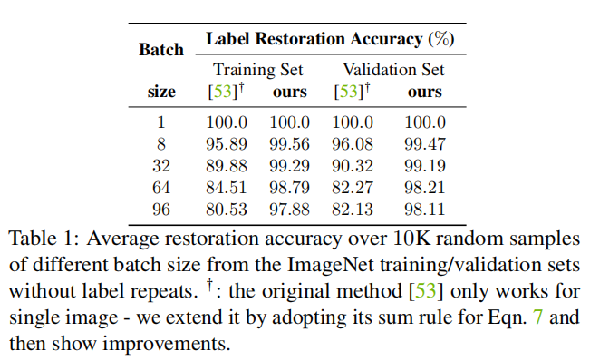
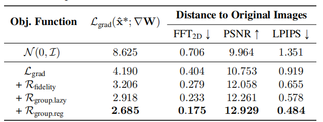

# See through Gradients: Image Batch Recovery via GradInversion

> 该论文收录与CVPR2021

之所以介绍这个工作，是因为这个攻击通过梯度对于其他人的训练数据进行还原，效果也十分不错。

先前的攻击大多是成员推断攻击（membership inference）, 大家使用差分隐私（DP，Differential Privacy）来进行数据的保护。成员推断攻击的目的是推断一个数据是否被用于模型的训练，但是一般来说大家会假设攻击者手上有一堆数据，既包括训练数据的一部分，也包括一些额外的数据。这个假设还是比较强的，在实际上，攻击者可能根本拿不到训练数据的一部分。

仍然缺少一个比较强的攻击，而这次的工作通过梯度对训练数据进行逆向，结果还十分不错，相当值得分享给大家！

关于联邦学习

首先需要先介绍一下联邦学习，如下图所示：

会有许多参与者一同参与训练过程，每一个参与者拥有自己的数据，并且在本地进行训练，本地训练完之后会上传模型参数，由一个中心节点对进行模型的聚合，然后再下发到每一个参与者本地进行模型的同步。

联邦学习的优势在于，每一个节点的数据都保持在本地，保证了数据隐私，实现了异构数据的访问（也就是每一个参与者自己解决数据的访问问题，即便数据是异构的不会影响整体）。

但是，参与者仍然要将模型上传，这会不会造成数据隐私泄漏呢？

### 基于梯度的数据还原

首先，我们先给出目标的形式化：
$$
x^* = \arg \min_{\hat{x}} \mathcal{L}_{grad}(\hat{x};W, \Delta W) + \mathcal{R}_{aux}(\hat{x})
$$
其中

其中  $ \hat{x} \in \mathbb{R}^{K\times C\times H\times W}  $ ( $ K $  是batch size,  $ C , H , W $  分别是通道数、高度、宽度)， 式子中的  $ W $ 是模型的权重， $ \Delta W $  是聚合后的模型权重的变化量。

其中  $ \mathcal{L}_{grad} $ 的目的是，找到一些可能的输入，使得用这些输入训练后得到的权重，与聚合后的权重尽可能一致。

具体形式为
$$
\mathcal{L}_{grad}(\hat{x};W,\Delta W)=\alpha_G\Sigma_{l}||\nabla_{W^{(l)}}\mathcal{L}(\hat{x},\hat{y}) - \Delta W^{(l)}||_2
$$
其中 $ \Delta W^{(l)} = \nabla_{W^{(l)}}\mathcal{L}(x^*,y^*) $ , 代表真实的训练数据导致的第 $ l $ 层权重的变化量

先前的优化式子还有一项，称之为辅助的正则项（auxiliary regularization），具体形式为
$$
\mathcal{R}_{aux}(x) = \mathcal{R}_{fidelity}(x) + \mathcal{R}_{group}(x)
$$
由两项组成，第一项驱使 $ x $ 与真实的训练样本相似 ，第二项是一致性，我们会在后续给出说明。

### 批量标签恢复

考虑分类任务，记真实数据为  $  x^* = [x_1,x_2,...,x_K] $  , 对应的标签为  $ y^* = [y_1,y_2,...,y_K] $ 

对应的真实的梯度为
$$
\nabla_W\mathcal{L}(x^*,y^*) = \frac{1}{K}\sum_{k}\nabla_W\mathcal{L}(x_k,y_k)
$$
其中的误差函数可以理解为交叉熵（Cross-Entropy）误差。

在分类任务中，网络的最后一层通常是一个全连接的线性层，我们将其记作 $ W^{(FC)}\in \mathbb{R}^{M\times N} $ 

其中 $ M $ 是输入特征的维数， $ N $ 是目标类别的总数目

对于训练样本 $ (x_k,y_k) $ 而言，记其线性层的增量为 $ \Delta W^{(FC)}_{m,n,k}=\nabla_{w_{m,n}}\mathcal{L}(x_k,y_k) $ 

应用链式法则，可以得到：
$$
\Delta W^{(FC)}_{m,n,k} = \nabla_{z_{n,k}}\mathcal{L}(x_k,y_k)\times\frac{\partial z_{n,k}}{\partial w_{m,n}}
$$
其中 $ z_{n,k} $ 代表输入为 $ x_k $ 的最终经过softmax层的第 $ n $ 出，梯度的形式为
$$
\nabla_{z_{n,k}}\mathcal{L}(x_k,y_k)=p_{k,n} - y_{k,n}
$$
也就是对应类别的概率减去标签值

注意到:
$$
\frac{\partial z_{n,k}}{\partial w_{m,n}} = o_{m,k}
$$
其中 $ o_{m,k} $ 就是全链接层的第  $ m $  个输入。

这里需要解释一下，因为 $ W^{(FC)}\in \mathbb{R}^{M\times N} $ ，其输入为一个  $ M $  维向量  $  \mathbb{R}^M $ 

对于一个特定的类别 $ n $  , 其输出为 $ z_n = v\cdot W[:,n] = \sum_{i=1}^{M} v_{i}w_{i,n} $ 

那么，立即有 $ \frac{\partial z_{n,k}}{\partial w_{m,n}} = \frac{\partial \sum_{i=1}^{M} v_{i}w_{i,n}}{\partial w_{m,n}} = v_{m} $ , 也就是 $ o_{m,k} $ 

由于线性层的输入，通常都是经过ReLU或者sigmoid的激活，所以一般都是非负的，

那么，先前的全连接层的参数的增量 $ \Delta W^{(FC)}_{m,n,k} = \nabla_{z_{n,k}}\mathcal{L}(x_k,y_k)\times\frac{\partial z_{n,k}}{\partial w_{m,n}} $ ，其中的 $ \nabla_{z_{n,k}}\mathcal{L}(x_k,y_k) $ 这一部分，当且仅当 $ k ∗ n = n_k^*  $ (也就是对应正确的类别时) 这一部分为负。

于是，针对输入 $ x_k $ , 我们可以通过上述变化量的符号来判别目标类别，记
$$
S_{n,k} = \sum_{m}\Delta W^{(FC)}_{m,n,k}=\sum_{m}\nabla_{z_{n,k}}\mathcal{L}(x_k,y_k)\times o_{m,k}
$$
一旦  $ S_{n,k} \lt 0 $ , 便意味着 $ x_k $  的类别是 $ n $ 

不过，上述这一切都是基于单个输入 $ x_k $ 的，针对 $ K $ 个输入，我们有
$$
s_n = \frac{1}{K}\sum_{k}S_{n,k} = \sum_{m}(\frac{1}{K}\sum_k\Delta W^{(FC)}_{m,n,k})
$$
这样便产生了一个问题：**平均之后的增量，信息出现了丢失，该如何推断类别呢？**

这个工作有一个发现，即
$$
|S_{n_k^*, k}| \gg |S_{n\neq n^*_k, k}|
$$
这意味着，标签的显著性还是比较高的，我们还是可以通过其绝对值来推断，**并且，多个样本的梯度聚合之后，负的部分仍然是负的，显现出原始标签的信息**。

为了使得这种负号的标志更为鲁棒，文章使用了逐列的最小值，而不是按照特征维度进行求和

即
$$
\hat{y} = \arg \text{sort}(\min_{m}\nabla_{W^{(FC)}_{m,n}}\mathcal{L}(x^*,y^*))[:K]
$$

我们来解释上面这个式子，首先注意到 $ \nabla_{W^{(FC)}_{m,n}}\mathcal{L}(x^*,y^*) \in \mathbb{R}^{M\times N} $  是一个 $ M\times N $ 的矩阵

 $ \min \nabla_{W^{(FC)}_{m,n}}\mathcal{L}(x^*,y^*) $ 也就是求出这个矩阵最小的那一行，具有 $ N $  维， 然后从小到大排序（负的都在前面）

 $ \arg \text{sort} $ 其实就是返回排序后的下标，在这里就对应了类别，直接返回前 $ K $ 小的值，也就对应着 $ K $ 个样本的类别

> 这里有一个假设，也就是一个批次里面没有重复类别的数据，大家需要注意一下！

### 真实性正则化

这里是借鉴 DeepInversion 中针对图片的自然性的优化

> Dreaming to distill: Data-free knowledge transfer via DeepInversion.

文中加入了一个正则化项 $ \mathcal{R}_{fidelity}(\cdot) $ ，来驱使生成的 $ \hat{x} $ 尽可能保持真实，具体形式为：
$$
\mathcal{R}_{fidelity}(\hat{x}) = \alpha_{tv}\mathcal{R}_{TV}(\hat{x}) + \alpha_{l_2}\mathcal{R}_{l_2}(\hat{x}) + \alpha_{BN}\mathcal{R}_{BN}(\hat{x})
$$
其中 $ \mathcal{R}_{TV} $ 和  $ \mathcal{R}_{l_2} $ 分别惩罚图像的方差和 $ L2 $ 范数，属于标准的图像先验。

DeepInversion中关键的部分就是使用了BN的先验来进行约束
$$
\mathcal{R}_{BN}(\hat{x}) = \sum_{l}||\mu_l(\hat{x}) - BN_l(mean)||_2 +\sum_{l}||\sigma_l^2(\hat{x}) - BN_l(variance)||_2
$$

其中 $\mu_l(x)$ 和 $ \sigma_l^2(x) $ 是第  $  l              $  层卷积的，对于一个批数据的均值和方差的估计

这种真实性的正则化能够促使图片变得更加真实

### 组一致性正则化

在进行训练数据恢复的时候，会有一个挑战，也就是物体实际位置的确定，如下图所示：

在实验中，作者使用了不同的随机种子进行图像的还原，结果产生不同程度上的偏移，但这些样本其实语义上都是一致的。

基于这个观察，作者提出了一种组一致性的正则化方法，**也就是用不同的随机种子生成，然后对这些结果进行融合**。

其正则化形式为：
$$
 \mathcal{R}_{group}(\hat{x},\hat{x}_{g\in G}) = \alpha_{group}||\hat{x}-\mathbb{E}(\hat{x}_{g\in G})||_2
$$
其中，我们需要计算出这个期望 $\mathbb{E}(\hat{x}_{g\in G})$ ，其实就是**平均图像**

如上图所示，首先按像素进行平均，得到一张平均图像，然后所有图像根据这个平均图像进行对齐，之后再取一次平均，得到最后的对齐后的平均图像。

### 最终的更新细节

文中使用的是一种基于能量的模型，受 Langevin 的启发，具体形式为
$$
\Delta_{\hat{x}^{(t)}} \leftarrow \nabla_{\hat{x}}(\mathcal{L}_{grad}(\hat{x}^{(t-1)},\nabla W) + \mathcal{R}_{aux}(\hat{x}^{(t-1)}))\\ \eta \leftarrow \mathcal{N}(0, I)\\ \hat{x}^{(t)} \leftarrow \hat{x}^{(t-1)} + \lambda(t)\Delta_{\hat{x}^{(t)}} + \lambda(t)\alpha_n\eta
$$
其中 $\eta$ 是采样噪声，用于进行搜索；$ \lambda(t)$ 是学习率；$\alpha_n$ 是缩放因子。

### 实验分析

标签恢复的正确率如下所示：

可以看到，随着批次大小的增加，正确率就会下降，原因其实就是重复类别的问题，但是相比起iDLG (iDLG: Improved deep leakage from gradients) 要好很多。

然后是每一个误差项的消融实验：

可以看到，添加真实性以及组一致性，的确会使得图片质量上升，对齐的增益也是存在的。

如上图所示，基本上还原的结果已经逼近原始图片了

然后，和目前的SOTA进行效果对比，这里直接给出一部分的结果图

可以看到，其效果要比DeepInversion，Latent Projection等工作要好得多！

之后，我们必须看一看批次大小，也就是BatchSize，对于还原效果的影响

可以看到，随着批次大小的增加，还原效果会变差，这也是符合常理的，因为聚合带来的信息损失会增大。

### 结论

这个工作是里程碑式的，在联邦学习的场景下，实现了一次强而有力的攻击！

这也会极大的启发，针对联邦学习这种类分布式训练的场景下后续的防御工作。

DP等防御方法是否还能适用？参与者的变动是否会有影响？本地的多次训练是否加大了恢复的难度？

仍然有许多工作需要我们一起探索。
